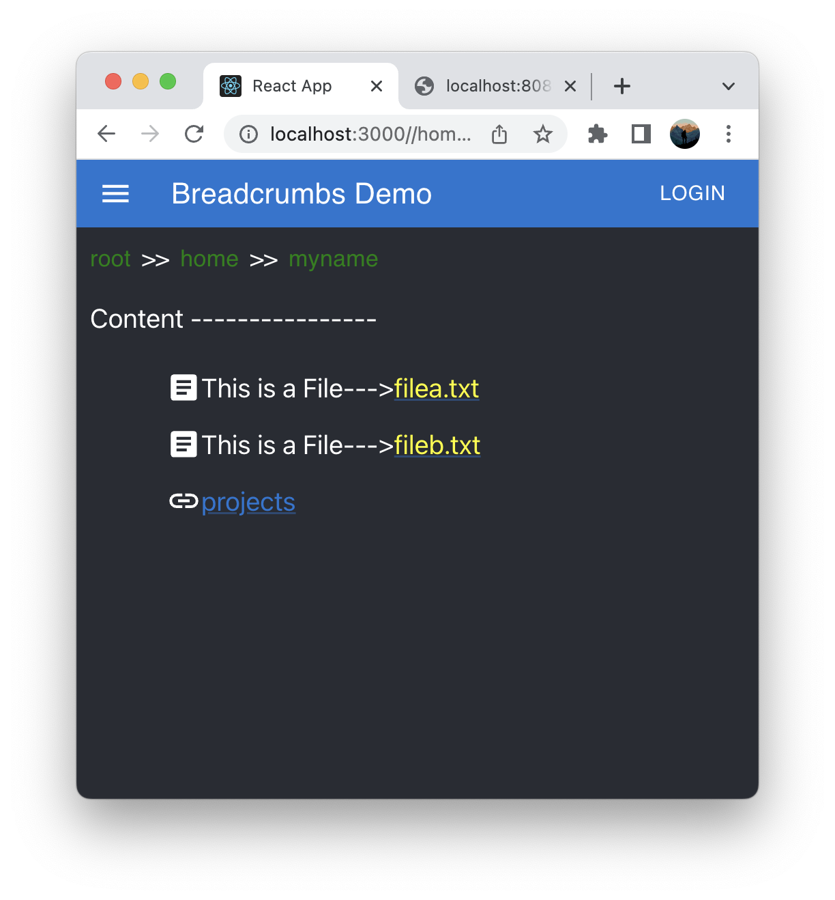
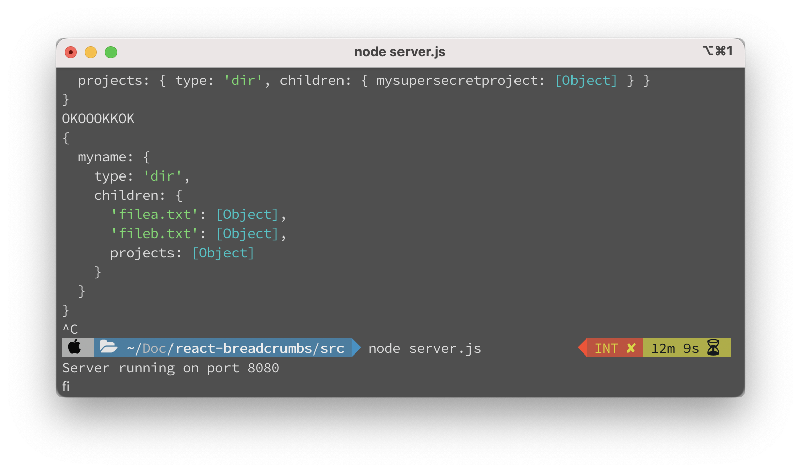
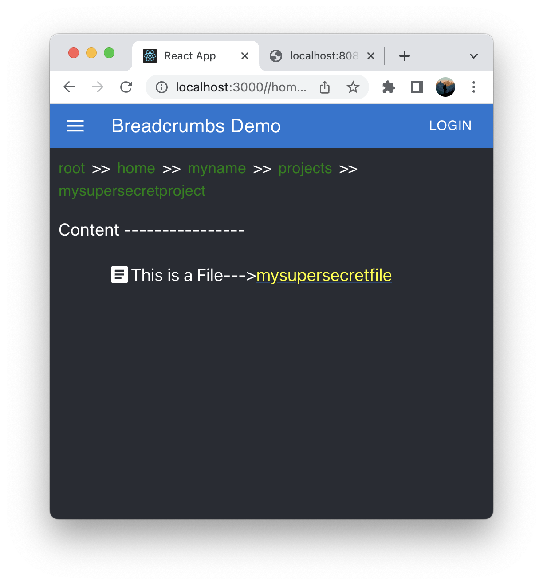

# React-Breadcrumbs
--------

## Link to site
(https://r97draco.github.io/react-breadcrumbs/)

## How to start
1. Clone or download the project.
2. Run following command to install node modules
<br>```npm install```
2. Run server.js present in /src directory using:
<br>```node server.js```
3. Run following in terminal
<br>```npm start```

## About application
1. Breadcrumb1
<br><br><br>
2. Node server
<br><br><br>
3. Breadcrumb2
<br><br><br>


